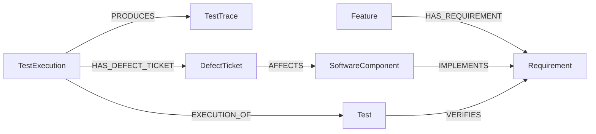

# Ontology Diagram — Version 1

## Concepts

* `Feature` — a user-visible automotive capability.
* `Requirement` — a statement describing expected system behavior.
* `SoftwareComponent` — a software unit responsible for implementing system behavior.
* `Test` — a reusable definition of what should be verified.
* `TestExecution` — one specific execution of a test.
* `TestTrace` — diagnostic information or logs produced during a test execution.
* `DefectTicket` — a recorded software problem identified during testing.

## Relationships

* `Feature HAS_REQUIREMENT Requirement`
* `SoftwareComponent IMPLEMENTS Requirement`
* `Test VERIFIES Requirement`
* `TestExecution EXECUTION_OF Test`
* `TestExecution PRODUCES TestTrace`
* `TestExecution HAS_DEFECT_TICKET DefectTicket`
* `DefectTicket AFFECTS SoftwareComponent`

## Relationship meanings

* `HAS_REQUIREMENT` connects a feature to one of its requirements.
* `IMPLEMENTS` connects a software component to the requirement it implements.
* `VERIFIES` connects a test definition to the requirement it checks.
* `EXECUTION_OF` connects a specific test execution to its reusable test definition.
* `PRODUCES` connects a test execution to its diagnostic trace or log.
* `HAS_DEFECT_TICKET` connects a test execution to a defect discovered or observed during that execution.
* `AFFECTS` connects a defect ticket to the software component associated with the problem.

The arrow direction represents how each relationship will be stored in the Neo4j knowledge graph.

This is the initial ontology version for the PoC. It may be refined later if the synthetic dataset or investigation queries reveal that another concept or relationship is needed.
