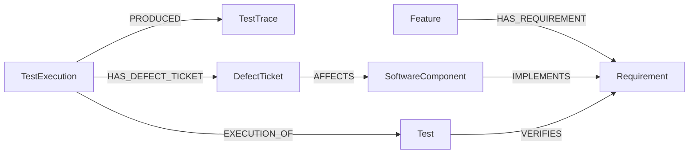

# Ontology Diagram — Version 1

## Concepts

* `Feature` — a user-visible automotive capability.
* `Requirement` — a statement describing expected system behavior.
* `SoftwareComponent` — a software unit responsible for implementing behavior.
* `Test` — a reusable test definition.
* `TestExecution` — one specific execution of a test.
* `TestTrace` — diagnostic information produced during a test execution.
* `DefectTicket` — a recorded software problem.

## Relationships

* `Feature HAS_REQUIREMENT Requirement`
* `SoftwareComponent IMPLEMENTS Requirement`
* `Test VERIFIES Requirement`
* `TestExecution EXECUTION_OF Test`
* `TestExecution PRODUCED TestTrace`
* `TestExecution HAS_DEFECT_TICKET DefectTicket`
* `DefectTicket AFFECTS SoftwareComponent`

The arrow direction represents how each relationship will be stored in the knowledge graph.
