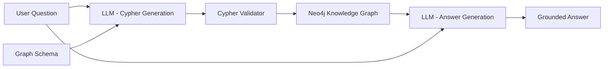

# Ontology-Aware AI Querying

## Goal

This experiment demonstrates how an LLM can use the graph schema to translate a natural-language engineering question into Cypher, retrieve connected facts from Neo4j, and generate an answer grounded in those facts.

It is not a production GraphRAG implementation.

## Architecture



The main flow is:

1. The user asks a natural-language question.
2. The LLM receives the graph schema.
3. The LLM determines which graph relationships should be traversed.
4. The LLM generates a read-only Cypher query.
5. The query is validated before execution.
6. Python executes the query against Neo4j.
7. Neo4j returns structured graph facts.
8. The LLM produces a natural-language answer using the retrieved facts.

## Code Structure

```text
src/
├── schema.py
├── neo4j_client.py
├── llm_client.py
├── cypher_validator.py
├── query_service.py
└── cli.py
```

Responsibilities:

- `schema.py` — provides the graph schema to the LLM.
- `neo4j_client.py` — manages the Neo4j connection and executes queries.
- `llm_client.py` — handles LLM calls for Cypher generation and answer generation.
- `cypher_validator.py` — blocks potentially destructive Cypher.
- `query_service.py` — orchestrates the complete question-to-answer pipeline.
- `cli.py` — provides the command-line interface.

## Example

Question:

```text
Why did EXEC-010 fail?
```

The LLM can use relationships such as:

```text
TestExecution
→ EXECUTION_OF
→ Test

TestExecution
→ PRODUCES
→ TestTrace

TestExecution
→ HAS_DEFECT_TICKET
→ DefectTicket
→ AFFECTS
→ SoftwareComponent
```

The generated Cypher retrieves the related execution, test, traces, defect, and component.

The final answer is then generated from the retrieved Neo4j facts.

## Tested Questions

The prototype was tested with questions including:

- `What requirement does EXEC-010 verify?`
- `What software component is related to EXEC-010 and why?`
- `Why did EXEC-010 fail?`
- `Did failures related to the same defect as EXEC-010 occur in other executions and test environments?`
- `Which requirement was being tested when execution EXEC-010 failed?`

It was also tested with:

- a question requesting information that is not represented in the graph;
- a request to delete graph data.

The system did not invent the missing engineer information and did not execute the destructive request.

## What This Demonstrates

The important part of the experiment is that investigation queries are not manually selected for each question.

Instead, the LLM receives the graph schema and uses relationships between engineering concepts to construct the required traversal.

For example:

```text
TestExecution
→ EXECUTION_OF
→ Test
→ VERIFIES
→ Requirement
← IMPLEMENTS
← SoftwareComponent
```

The Knowledge Graph therefore provides a structured map of the engineering domain that can guide AI retrieval.

## Limitations

This is a small experimental implementation.

Current limitations include:

- Cypher generated by the LLM may still be incorrect.
- The graph schema is provided manually to the LLM.
- Read-only validation is intentionally simple.
- The answer quality depends on the facts retrieved by the generated query.
- The LLM may occasionally overstate the meaning of retrieved evidence.
- There is no vector search or semantic document retrieval.
- There is no conversational memory between questions.
- There is no frontend, REST API, authentication, or deployment.
- This should not be considered a complete production GraphRAG system.

## Run

Start Neo4j and activate the Python virtual environment.

Then run:

```powershell
python src\cli.py
```

Enter an engineering question when prompted:

```text
Ask a question: Why did EXEC-010 fail?
```

The CLI displays:

```text
GENERATED CYPHER
NEO4J RESULT
AI ANSWER
```